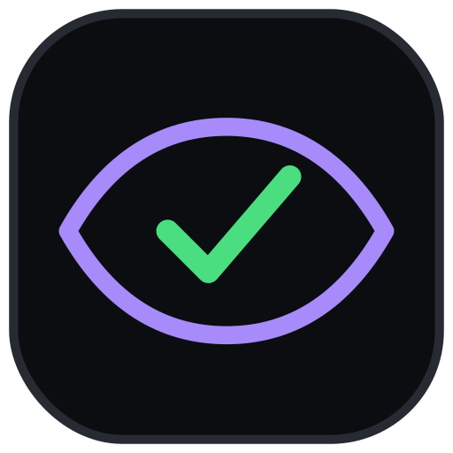
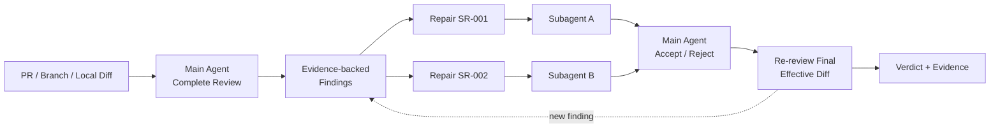

<div align="center">



# SuperReview

### The main agent owns judgment. Subagents only repair.

**Review the whole change first, delegate atomic repairs second, and make the main agent verify the final effective diff.**

[](https://github.com/fightheyyy/SuperReview)


[中文](./README.md) · [30-second overview](#30-second-overview) · [Quick start](#quick-start) · [The Super trio](#the-super-trio)

</div>

---

SuperReview is a code-review skill for **Codex, AI coding agents, and multi-agent development workflows**.

Strong models can already launch subagents on their own. Review judgment should not be delegated with the implementation work. SuperReview establishes a simple ownership boundary:

- The main agent personally reads the complete change, surrounding code, and tests before creating findings.
- Only a confirmed, evidence-backed finding can become an atomic repair task.
- Subagents repair bounded findings; they do not define review scope, priority, or the final verdict.
- The main agent inspects every patch, independently verifies it, and re-reviews the final effective diff including uncommitted repairs.

## 30-second overview



The core gate is strict: **no repair delegation before the main agent completes the initial review and freezes its findings.**

## Why it exists

| Common failure | SuperReview constraint |
|---|---|
| A subagent finds issues and chooses its own scope | Only the main agent establishes findings |
| A worker says “fixed” and the patch is trusted | The main agent inspects and independently verifies it |
| Agents edit overlapping files concurrently | Parallel repair requires disjoint write sets |
| `base..HEAD` omits uncommitted repairs | Review the final effective diff including worktree repairs |
| A generic review request unexpectedly edits code | Implicit invocation stays report-only |
| Review silently commits, pushes, or publishes comments | External actions require explicit authorization |

## Supported review targets

- GitHub pull requests
- branch versus base / merge base
- commit ranges
- staged changes
- working-tree changes
- explicit combinations of those boundaries

SuperReview can therefore accept local subagent work before it has been committed or turned into a PR.

## Three modes

### Review and repair

Explicitly invoke `$superreview`, or ask to review and fix. The main agent reviews first and then dispatches confirmed findings as atomic repairs.

### Report only

A generic “review this PR” or “inspect these changes” request reports findings without editing code or launching repair workers.

### Repair existing findings

When the user supplies accepted findings, the main agent validates that each finding still applies before dispatching a repair.

## Quick start

Install the repository as a Codex skill:

```bash
git clone https://github.com/fightheyyy/SuperReview.git ~/.codex/skills/superreview
```

Invoke it in Codex:

```text
$superreview review and repair PR #123
```

Run a report-only review:

```text
$superreview review PR #123 in report-only mode
```

Review local, uncommitted work:

```text
$superreview review and repair the staged and working-tree changes
```

## Findings and repair contracts

Every finding needs a stable ID, priority, tight location, observable failure, evidence, minimal repair boundary, and focused verification.

Every subagent receives one bounded repair contract:

```text
Repair: SR-001 <one-sentence objective>
Finding Evidence: <failure, cause, location>
Acceptance: <observable stop condition>
Allowed Scope: <exact files/modules>
Forbidden Work: <unrelated cleanup and broad refactors>
Required Verification: <focused checks>
```

A worker may return evidence that a finding is a false positive. It may not broaden scope or claim PR-level acceptance.

## The Super trio

SuperReview works independently or alongside two companion skills:

```text
SuperGoal   → define outcomes, dispatch work, control stop conditions
SuperDev    → align Current / Target Architecture
SuperReview → own findings, delegate atomic repairs, verify the verdict
```

- [SuperGoal](https://github.com/fightheyyy/SuperGoal): goal orchestration and completion criteria.
- [SuperDev](https://github.com/fightheyyy/SuperDev): architecture context and implementation gates.
- **SuperReview**: code review, repair delegation, and final acceptance.

For substantial work, use `SuperGoal + SuperDev` during implementation and `SuperReview` to accept the resulting change set.

## Safety boundary

By default, SuperReview does not:

- publish GitHub reviews or comments;
- approve, request changes, or resolve threads;
- commit, push, merge, or open another PR;
- absorb unrelated dirty-worktree changes into the review target.

Those actions require explicit user authorization.

## Repository contents

- [`SKILL.md`](./SKILL.md): the complete SuperReview workflow and ownership invariant.
- [`agents/openai.yaml`](./agents/openai.yaml): Codex display and invocation metadata.
- [`assets/superreview-icon.svg`](./assets/superreview-icon.svg): the primary review-lens and final-verdict mark.
- [`docs/social-preview.png`](./docs/social-preview.png): the GitHub repository social preview.
- [`README.md`](./README.md): Chinese documentation.

If you believe **review judgment belongs to the main agent and subagents should perform bounded repairs**, star the repository and help more AI-assisted development teams discover this workflow.
