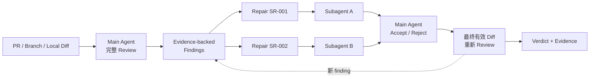

<div align="center">

# SuperReview

### 主 agent 负责判断，subagent 只负责修

**先完整 review，再分派原子修复，最后由主 agent 验收整个有效 diff。**

[](https://github.com/fightheyyy/SuperReview)


[English](./README.en.md) · [30 秒看懂](#30-秒看懂) · [快速开始](#快速开始) · [Super 三件套](#super-三件套)

</div>

---

SuperReview 是一个面向 **Codex、AI coding agent 和多 agent 开发工作流**的代码审查 skill。

强模型已经会主动调用 subagent，但 review 的判断权不应该一起外包。SuperReview 固定了一条简单的所有权边界：

- 主 agent 亲自读取完整改动、上下文和测试，形成有证据的 findings。
- 每个 confirmed finding 才能变成一个边界明确的原子修复任务。
- subagent 只负责修复，不负责定义 review 范围、严重级别或最终结论。
- 主 agent 检查每份补丁、独立复验，并重新 review 包含未提交修复的最终有效 diff。

## 30 秒看懂



关键门槛只有一个：**主 agent 完成首轮 review 并冻结 findings 之前，不允许把 review 分派出去。**

## 为什么需要它

| 常见问题 | SuperReview 的约束 |
|---|---|
| subagent 自己找问题、自己定范围 | findings 只能由主 agent 建立 |
| worker 说“修好了”就直接相信 | 主 agent 必须检查补丁并独立复验 |
| 多个 agent 同时改同一批文件 | 只有写集不重叠时才允许并行 |
| 只看 `base..HEAD`，漏掉未提交修复 | review 最终有效 diff，包含 worktree repairs |
| 普通“帮我 review”意外改代码 | 隐式触发默认 report-only |
| review 顺手 commit、push 或发评论 | 外部动作必须由用户明确授权 |

## 支持的 Review Target

- GitHub pull request
- branch 对 base / merge base
- commit range
- staged changes
- working-tree changes
- 上述边界的显式组合

这让 SuperReview 不只适合 PR，也可以验收 subagent 刚完成、还没有提交的本地改动。

## 三种模式

### Review and repair

显式调用 `$superreview`，或明确要求 review and fix。主 agent 先审，再把 confirmed findings 分派成原子修复。

### Report only

普通的“review this PR / 检查这组改动”默认只输出 findings，不修改代码、不启动 repair worker。

### Repair existing findings

用户提供已接受的 finding 列表时，主 agent 先验证 finding 仍然成立，再分派修复。

## 快速开始

把仓库安装到 Codex skills 目录：

```bash
git clone https://github.com/fightheyyy/SuperReview.git ~/.codex/skills/superreview
```

然后在 Codex 中调用：

```text
$superreview review and repair PR #123
```

只审不修：

```text
$superreview review PR #123 in report-only mode
```

审查本地未提交改动：

```text
$superreview review and repair the staged and working-tree changes
```

## Finding 与 Repair Contract

每个 finding 都要包含稳定 ID、优先级、精确位置、可观察失败、证据、最小修复边界和关闭它所需的验证。

每个 subagent 只能拿到一个有边界的 repair contract：

```text
Repair: SR-001 <one-sentence objective>
Finding Evidence: <failure, cause, location>
Acceptance: <observable stop condition>
Allowed Scope: <exact files/modules>
Forbidden Work: <unrelated cleanup and broad refactors>
Required Verification: <focused checks>
```

worker 可以用证据证明 finding 是 false positive，但不能自行扩大范围，也不能宣称整个 PR 已通过。

## Super 三件套

SuperReview 可以独立使用，也可以和另外两个 skill 组合：

```text
SuperGoal  → 定义目标、拆分任务、控制停止条件
SuperDev   → 对齐 Current / Target Architecture
SuperReview → 主审 findings、分派原子修复、最终验收
```

- [SuperGoal](https://github.com/fightheyyy/SuperGoal)：目标编排与完成条件。
- [SuperDev](https://github.com/fightheyyy/SuperDev)：架构上下文与实现门槛。
- **SuperReview**：代码审查、修复分派与最终 verdict。

大型开发任务可以用 `SuperGoal + SuperDev` 完成实现，再用 `SuperReview` 验收最终 change set。

## 安全边界

SuperReview 默认不会：

- 发布 GitHub review 或评论；
- approve、request changes 或 resolve thread；
- commit、push、merge 或创建新 PR；
- 把无关的本地脏改动吸收到 review 范围。

这些动作只有在用户明确授权后才执行。

## 仓库内容

- [`SKILL.md`](./SKILL.md)：SuperReview 的完整工作流和 ownership invariant。
- [`agents/openai.yaml`](./agents/openai.yaml)：Codex 展示与默认调用元数据。
- [`README.en.md`](./README.en.md)：English documentation。

如果你也认为 **review judgment 应该留在主 agent，subagent 应该只做原子修复**，欢迎点一个 Star，让更多 AI-assisted development 项目看到这套工作方式。
